<table width="100%" style="border-collapse: collapse;">
  <tr>
    <td align="left" width="70%">
      <samp>
        <b>// Be Quiet and Code.</b>
      </samp>
    </td>
    <td align="right" width="30%">
      
    </td>
  </tr>
</table>

  <table>
    <tr>
      <td rowspan="2"></td>
      <td></td>
    </tr>
    <tr>
      <td></td>
    </tr>
  </table>

